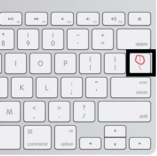

# Writing Good Documentation

## Step 1 - Using Codeblocks.

Codeblocks in markdown make it *very easy* for tech people to **copy, paste, share** code.
A good __Cloud Engineer__ uses Codeblocks whenever possible.

This is becasue it allows others to copy and paste their code to replicate or research issues.


- In order to create codeblocks in markdown you need to use three (`)
- Not to be confused with qoutations (')


- Make note of here the backtick keyboard key is located.
- It should appear above the return or enter key
- but it may vary based on your keyboard type.


```ruby
# Method to check if a number is prime
def is_prime?(num)
  return false if num <= 1
  (2..Math.sqrt(num)).each do |i|
    return false if num % i == 0
  end
  true
end

# Finding and printing prime numbers up to 100
(1..100).each do |number|
  puts number if is_prime?(number)
end
```
> Here is an example of ruby code using a codeblock.

- When you can, you should attempt to apply snytax highlighting to your codeblocks

Good Cloud Engineers use codeblocks for both **Code** and **Errors** that appear in the console. 
```bash
TypeError: Input must be a numeric value
    from (irb):2:in `is_prime?'
    from (irb):12:in `<main>'
```
> Here is an example of using a codeblock for an error that appears in bash.

When you can, always provide a codeblock instead of a screenshot.
If you need to take a screenshot, make sure it is not a photo from your phone. 

> There are certain cases where it is okay to take photos with your phone. This is when you are showing something like a keyboard, which does not appear on a computer screen. Another example that is okay is when you are booting up your computer.
Once you are logged in, and it is rendered on your computer screen, it should be a screenshot. 

## Step 2 - How to take a screenshot.

- A screenshot is when you capture a part of your screen from your laptop, desktop or phone. 

- This is not to be confused with taking a photo with your phone. 

### Taking Screenshots

#### macOS

1. **Entire Screen**
   - Press `Shift` + `Command` + `3`.
   - The screenshot will save to the desktop.

2. **Portion of the Screen**
   - Press `Shift` + `Command` + `4`.
   - Drag to select the area.
   - The screenshot will save to the desktop.

3. **Specific Window or Menu**
   - Press `Shift` + `Command` + `4` + `Space bar`.
   - Click the window or menu to capture.

4. **Using Screenshot App**
   - Press `Shift` + `Command` + `5` to open the Screenshot app.

For additional information please look at the external resources[<sup>[6]</sup>](#external-references)

#### Windows

1. **Entire Screen**
   - Press `PrtScn`.
   - Captures the entire screen to the clipboard.

2. **Active Window**
   - Press `Alt` + `PrtScn`.
   - Captures only the active window to the clipboard.

3. **Select Area to Capture**
   - Press `Windows` + `Shift` + `S`.
   - Use Snip & Sketch to select and capture.

4. **Save Screenshot as File**
   - Press `Windows` + `PrtScn`.
   - Saves the screenshot in the Pictures > Screenshots folder.


## Step 3 - Use Github Flavoured Markdown (GFM) Task Lists

Github extends Markdown to have a list where you can check off items. [<sup>[3]</sup>](#external-references)


- [x] Finish Step 1
- [ ] Finish Step 2
- [x] Finish Step 3


## Step 4 - Use Emojis (Optional)

GFM supports emoji shortcodes.
Here are some examples:

| Name | Shortcode<sup>[4]</sup> | Emoji |
| --- | --- | --- |
| Cloud | `:cloud:` | :cloud: |
| Cloud | `:cloud_with_snow:` | :cloud_with_snow: |
| Cloud | `:cloud_with_lightning:` | :cloud_with_lightning: |

## Step 5 - How to Create a table

You can use the following markdown format to create tables:
```md
| Name | Shortcode<sup>[4]</sup> | Emoji |
| --- | --- | --- |
| Cloud | `:cloud:` | :cloud: |
| Cloud | `:cloud_with_snow:` | :cloud_with_snow: |
| Cloud | `:cloud_with_lightning:` | :cloud_with_lightning: |
```
Github extends the functionality of Markdown tables to provide more alignment and table cell formatting options. [<sup>[5]</sup>](#external-references)



- Make note of here the pipe keyboard key is located.
- It should appear above the return or enter key
- but it may vary based on your keyboard type.


# Step 6 - How to link another folder or file

[Asset Folder](assets)


## External References
- [GitHub Flavored Markdown Spec](https://github.github.com/gfm/) <sup>[1]</sup>
- [Basic writing and formatting syntax (Github Flavoured Markdown)](https://docs.github.com/en/get-started/writing-on-github/getting-started-with-writing-and-formatting-on-github/basic-writing-and-formatting-syntax)<sup>[2]</sup>
- [GFM - Task Lists](https://docs.github.com/en/get-started/writing-on-github/getting-started-with-writing-and-formatting-on-github/basic-writing-and-formatting-syntax#task-lists)<sup>[3]</sup>
- [GFM - Emoji CheatSheet](https://github.com/ikatyang/emoji-cheat-sheet)<sup>[4]</sup>
- [GFM - Tables (with extentions)](https://github.github.com/gfm/#tables-extension-)<sup>[5]</sup>
- [More details on Apple Support](https://support.apple.com/en-us/102646)<sup>[6]</sup>
